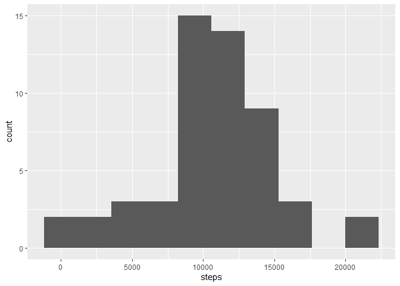
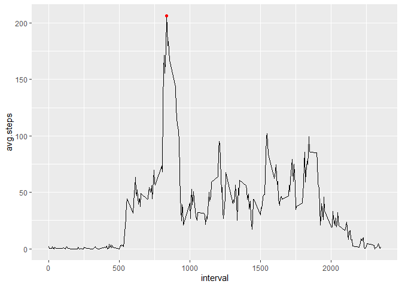
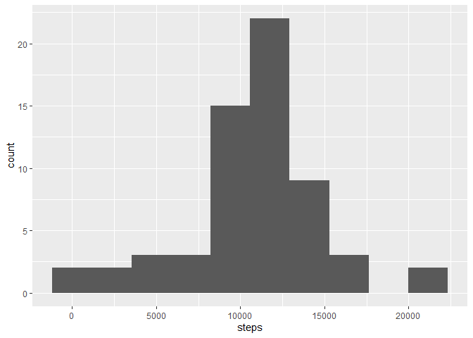
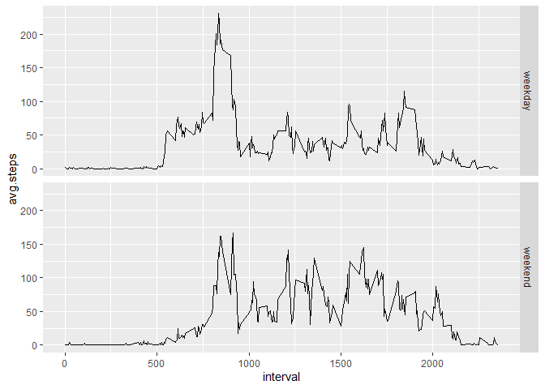

## Loading and preprocessing the data

First thing to do is loading necessary libraries.


```r
library(tidyverse)
```

```
## -- Attaching packages ----------------------------------------------------------------------------------------------- tidyverse 1.2.1 --
```

```
## v ggplot2 3.2.1     v purrr   0.3.2
## v tibble  2.1.3     v dplyr   0.8.3
## v tidyr   1.0.0     v stringr 1.4.0
## v readr   1.3.1     v forcats 0.4.0
```

```
## -- Conflicts -------------------------------------------------------------------------------------------------- tidyverse_conflicts() --
## x dplyr::filter() masks stats::filter()
## x dplyr::lag()    masks stats::lag()
```

Data for the assignment is contained in a zipped .csv file, *activity.zip*. The file first needs to be unzipped, and than csv needs to be loaded. Steps are taken to convert the date column into the date data format.


```r
unzip("activity.zip")
data <- read.csv("activity.csv", as.is = c(FALSE, TRUE, FALSE))
data$date <- as.Date(data$date, format = "%Y-%m-%d")
```

## What is mean total number of steps taken per day?

To answer this question, number of steps per day needs to be calculated. Then daily means and median can be calculated.


```r
daily <-
    data %>%
    group_by(date) %>%
    summarize(steps = sum(steps))

daily.mean <- mean(daily$steps, na.rm = TRUE)
daily.median <- median(daily$steps, na.rm = TRUE)
```

Distribution of steps per day is shown in the following figure.


```r
daily %>%
    ggplot(aes(steps)) +
    geom_histogram(bins = 10)
```

```
## Warning: Removed 8 rows containing non-finite values (stat_bin).
```

<!-- -->

Mean total number of steps per day is **10766.19**, while median total number of steps per day is **10765**.

## What is the average daily activity pattern?

To show avarage daily pattern, step count needs to be avaraged over daily 5 minute intervals.


```r
interval.avg <-
    data %>%
    group_by(interval) %>%
    summarise(
        avg.steps = mean(steps, na.rm = TRUE))

max.steps <-
    interval.avg %>%
    filter(avg.steps == max(avg.steps))

interval.avg %>%
    ggplot(aes(x=interval, y=avg.steps)) +
    geom_line() +
    geom_point(aes(x=max.steps$interval, y=max.steps$avg.steps), col="red")
```

<!-- -->

Interval with maximal average daily number of steps is 835, with a daily average of 206.1698113 steps.

## Imputing missing values

Missing values (NAs) are present in 2304 rows.

Given variability in the daily pattern, as shown above, we will use interval values to impute missing values in the data set. We will use interval means to replace missing values.


```r
imputed.data <-
    data %>%
    inner_join(interval.avg, by="interval") %>% 
    mutate(imputed.steps = if_else(is.na(steps), avg.steps, as.double(steps))) %>%
    select(steps, imputed.steps, date, interval)
```

We will create the histogram and calculate mean and median for the new data set.


```r
daily.imp <-
    imputed.data %>%
    group_by(date) %>%
    summarize(steps = sum(imputed.steps))

daily.mean.imp <- mean(daily.imp$steps, na.rm = TRUE)
daily.median.imp <- median(daily.imp$steps, na.rm = TRUE)

daily.imp %>%
    ggplot(aes(steps)) +
    geom_histogram(bins = 10)
```

<!-- -->

Mean total number of steps per day is **10766.19**, while median total number of steps per day is **10766.19**.

The histogram shows that distribution of daily totals is slightly shifted to the right after imputation.

## Are there differences in activity patterns between weekdays and weekends?

We will look into differences in acitvity patterns between weekdays and weekends using imputed data.


```r
wkd.interval.avg <- 
    imputed.data %>%
    mutate(
        wkday = weekdays(date),
        work.rest = as.factor(if_else(wkday %in% c("Saturday", "Sunday"), "weekend", "weekday"))
    ) %>%
    group_by(work.rest, interval) %>%
    summarize(avg.steps = mean(imputed.steps))

wkd.interval.avg %>%
    ggplot(aes(x = interval, y=avg.steps)) +
    geom_line() +
    facet_grid(work.rest~.)
```

<!-- -->
